Universidad Distrital Francisco José de Caldas. Arenas - Ramirez - Rocha. Patrones 

## integrantes:

* Hernan Arenas
* Andres Ramirez
* Kevin Rocha

## I introducción: 

En este documento, se encontrará información acerca de cuatro patrones de diseño; dos creacionales (Builder y Singleton) y dos estructurales (Decorator y Adapter), se explicará cada patrón detalladamente, su diagrama de clases, como será su implementación y cuál fue la razón para escoger específicamente estos patrones en vez de los otros existentes en GOF. 

## II Patrones de diseño:

Un patrón de diseño es un conjunto de objetos y clases organizados de cierta forma que ayudan a resolver un problema recurrente en el diseño de un software de una forma limpia y reusable.

Según el libro [Design Patterns: Elements of Reusable Object-Oriented Software](https://sophia.javeriana.edu.co/~cbustaca/docencia/DSBP-2018-01/recursos/Erich%20Gamma,%20Richard%20Helm,%20Ralph%20Johnson,%20John%20M.%20Vlissides-Design%20Patterns_%20Elements%20of%20Reusable%20Object-Oriented%20Software%20%20-Addison-Wesley%20Professional%20(1994).pdf), a los patrones se los puede clasificar en tres categorías:

* **Patrones Creacionales**
* **Patrones Estructurales**
* **Patrones de Comportamiento**

(en este documento solo se explicaran los dos primeros)

## III Patrones Creacionales

los patrones creacionales buscan principalmente solucionar los problemas acerca de cómo crear instancias de las clases de nuestra aplicación, basicamente buscan en cierta forma "despreocupar" al sistema de como sus objetos son creados o compuestos. Existen cinco tipos de patrones creacionales y a pesar que se nombrarán todos para que haya claridad, en este documento solo nos centraremos en los dos anteriormente mencionados. 

* **Abstract Factory:** permite trabajar con objetos de diferentes familias de manera que no se mezclen entre sí. De esa manera se consigue la el tipo de familia que se esté utilizando sea transparente.
* **Builder:** abstrae el proceso de creación de los objetos complejos, centralizandolo en pun punto.
* **Factory Method:** centraliza en una clase constructora la creación de objetos de un tipo determinado. Ocultando al invocante la necesidad de indicar un tipo u otro.
* **Prototype:** crea un objeto a partir de la clonación de un objeto ya existente.
* **Singleton:** garantiza que solo exista una instancia de un objeto y que la forma de acceder a dicha instancia sea general.

## III.I Patron Builder

Permite la creación de un objeto complejo, a partir de una variedad de partes que contribuyen individualmente a la creación y ensamblación del objeto mencionado. Hace uso de la frase "divide y conquistarás". Por otro lado, centraliza el proceso de creación en un único punto, de tal forma que el mismo proceso de construcción pueda crear representaciones diferentes.

Los objetos que dependen de un algoritmo tendrán que cambiar cuando el algoritmo cambia. Por lo tanto, los algoritmos que estén expuestos a dicho cambio deberían ser separados, permitiendo de esta manera reutilizar dichos algoritmos para crear diferentes representaciones. 

### ¿cuándo se debe usar este patrón?

se debe usar cuando sea necesario:

* Independizar el algoritmo de creación de un objeto complejo de las partes que constituyen el objeto y cómo se ensamblan entre ellas.
* Que el proceso de construcción permita distintas representaciones para el objeto construido, de manera dinámica.

Esta patrón debe utilizarse cuando el algoritmo para crear un objeto suele ser complejo e implica la interacción de otras partes independientes y una coreografía entre ellas para formar el ensamblaje. Por ejemplo: la construcción de un objeto Computadora, se compondrá de otros muchos objetos, como puede ser un objeto PlacaDeSonido, Procesador, PlacaDeVideo, Gabinete, Monitor, etc.

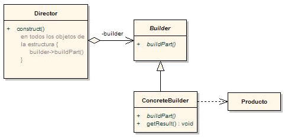

*Fig 1. Diagrama UML Builder*

* **Producto:** representa el objeto complejo a construir.
* **Builder:** especifica una interface abstracta para la creación de las partes del Producto. Declara las operaciones necesarias para crear las partes de un objeto concreto.
* **ConcreteBuilder:** implementa Builder y ensambla las partes que constituyen el objeto complejo.
* **Director:** construye un objeto usando la interfaz Builder. Sólo debería ser necesario especificar su tipo y así poder reutilizar el mismo proceso para distintos tipos.

El Cliente crea el objeto Director y lo configura con el objeto Builder deseado.

El Director notifica al constructor cuándo una parte del Producto se debe construir.

El Builder maneja los requerimientos desde el Director y agrega partes al producto.

El Cliente recupera el Producto desde el constructor.

### ¿Por qué se escogió?

El patrón builder es un patrón usado muy frecuentemente en la programación, por esto se consideró pertinente, enfatizar en su explicación con respecto a los demás patrones. 

a continuación se verá un ejemplo de como utilizar builder:

El objetivo del ejemplo es poder crear un objeto Auto (este sería nuestro producto). El auto se compondrá de varios atributos que lo componen: motor, marca, modelo y cantidad de puertas. En nuestro ejemplo, el auto no se compone de muchos objetos complejos. De hecho, se compone de sólo 4 objetos relativamente sencillos. Esto es para poder hacer entendible la propuesta del Builder y no perderse en los objetos que lo componen. Queda en la imaginación del lector la posibilidad de trabajar con ejemplos más complejos. Yo particularmente usé mucho este patrón cuando trabajé con archvios.

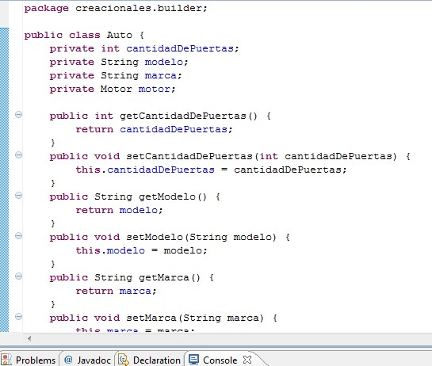

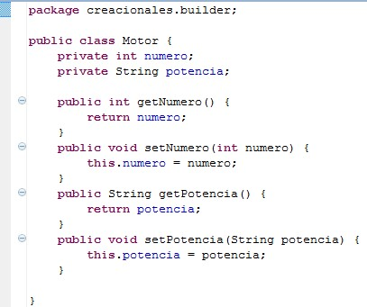

Siguiendo con nuestro ejemplo, definimos nuestro Builder llamado AutoBuilder. El Builder define al menos dos cosas: un método para devolver el Producto (el auto en nuestro caso) y los métodos necesarios para la construcción del mismo.

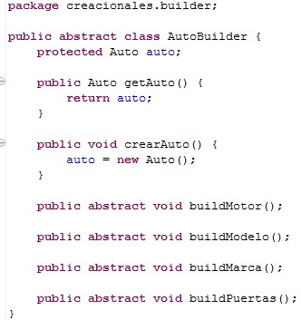

Serán los ConcreteBuilders los encargados de colocarle la lógica de construcción de cada Auto en particular. En nuestro caso, tendremos dos ConcreteBuilder: FiatBuildery FordBuilder. Recordemos que, en nuestro ejemplo, son clases que construyen objetos muy sencillos con datos hardcodeados para facilitar el aprendijaze del patrón en sí.

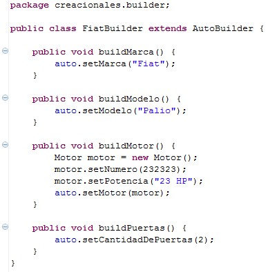

Por último, realizaremos el Director. Lo primero que debe hacerse con esta clase es enviarle el tipo de auto que se busca construir (Ford, Fiat, etc). Luego, al llamar al método constructAuto(), la construcción se realizará de manera automática. 

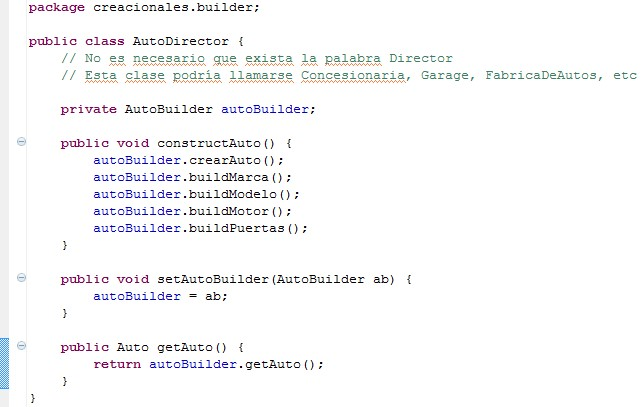

la vista desde el cliente sería:

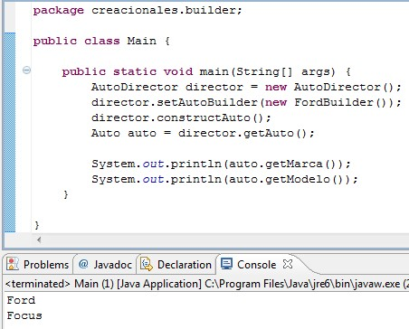

## III.II Patron Singleton 

La idea del patrón Singleton es proveer un mecanismo para limitar el número de instancias de una clase. Por lo tanto el mismo objeto es siempre compartido por distintas partes del código. Puede ser visto como una solución más elegante para una variable global porque los datos son abstraídos por detrás de la interfaz que publica la clase singleton.

Dicho de otra manera, esta patrón busca garantizar que una clase sólo tenga una instancia y proporcionar un punto de acceso global a ella.

### ¿cuándo se debe usar este patrón?

* Debe haber exactamente una instancia de una clase y deba ser accesible a los clientes desde un punto de acceso conocido.
* Se requiere de un acceso estandarizado y conocido públicamente.

Sus usos más comunes son clases que representan objetos unívocos. Por ejemplo, si hay un servidor que necesita ser representado mediante un objeto, este debería ser único, es decir, debería existir una sola instancia y el resto de las clases deberían de comunicarse con el mismo servidor. Un Calendario, por ejemplo, también es único para todos.

No debe utilizarse cuando una clase esta representando a un objeto que no es único, por ejemplo, la clase Persona no debería ser Singleton, ya que representa a una persona real y cada persona tiene su propio nombre, edad, domicilio, DNI, etc.
 
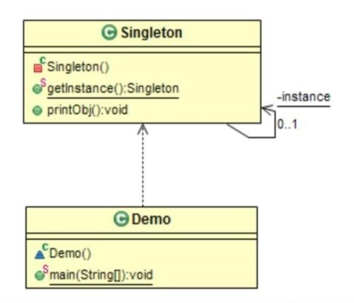

*Firg 2. Estructura Singleton tomado de la app de GoF** 

### **Interpretación:** 

Crear una clase Singleton con una instancia estática y un constructor privado. Proviene un método estático para permitir solamente el acceso a la instancia. 

### **Singletonitis:** 

Debido a que Singleton es probablemente el patrón más sencillo del GoF, muchas veces las personas abusan de su uso y ponen el patrón donde es innecesario, a este uso indebido se le conoce como Singletonitis. 

acontinuación se mostrará un ejemplo de como implementar singleton:

Este patrón es ideal para aquellas clases que representan objetos únicos. Por ejemplo, un instituto educativo es un objeto único. No deberíamos crear muchas instancias de esta clase ya que al hacer esto estaríamos diciendo que hay varios institutos educativos. Caso contrario serían los alumnos que asisten a dicho instituto. Debería haber un objeto por cada uno de los alumnos, ya que todos ellos tienen propiedades distintivas, desde el nombre hasta el documento de identidad. Pero todos los alumnos deberían comunicarse con el mismo instituto.

Entonces, haremos que el instituto aplique el patrón Singleton:

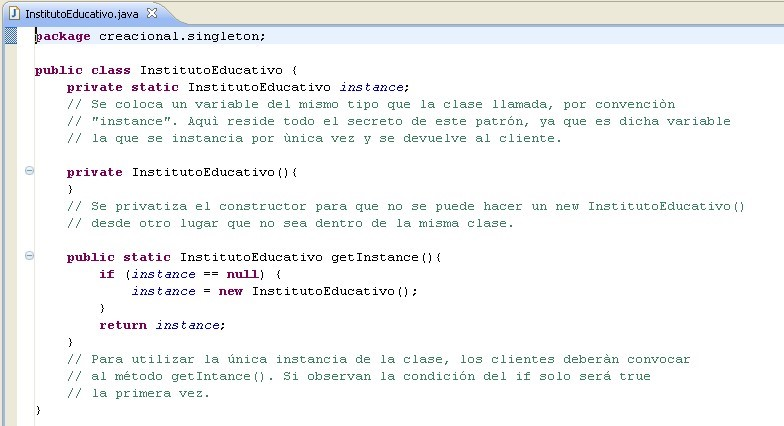

Para llamar al instituto debemos hacer lo siguiente:

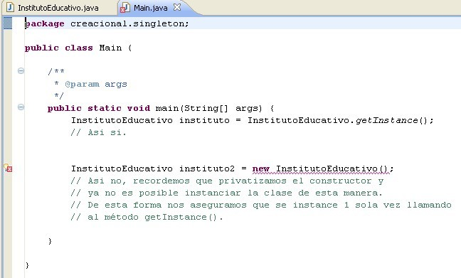

Bien, veamos ahora este mismo ejemplo, con una pequeña modificación: vamos a agregarle un atributo a la clase InstitutoEducativo y veremos como se comporta a lo largo de las distintas llamadas al método getInstance().

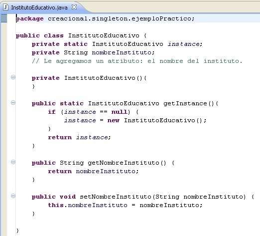

Y, el main, que representa al cliente que necesita utilizar esta clase:

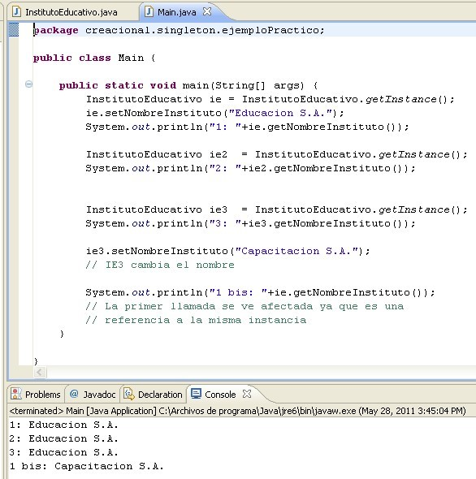

 
### Otros temas a considerar.
  
Como vimos, el Singleton es un patrón sencillo para aplicar. Solo requiere de unos pequeños cambios a una clase. Sin embargo, debemos considerar un tema importante con respecto a este patrón: ¿que pasa si dos hilos del programa llaman (la primera vez) al método getInstance() al mismo tiempo? Bueno aqui podriamos tener un problema, ya que existe la remota posibilidad de que se logre crear dos instancias de la clase, en vez de una como quisieramos. La solución más sencilla es realizar un pequeño cambio:

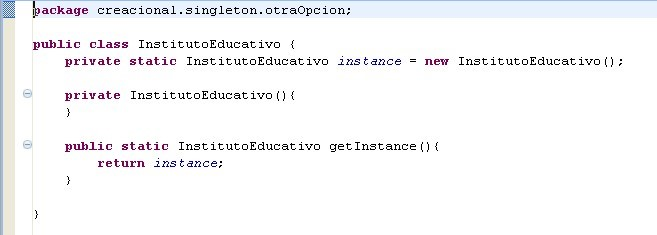

### ¿Por qué se escogió?

El patrón singleton es uno de los patrones creacionales más sencillos, pero también es uno a de los que más se puede sacar provecho si se implementa bien, por esta razón, se decidió profundizar en el por encima de los otros.

## III.III Prototype
Segun la definicion, este patron se puede definir como:

"tiene como finalidad crear nuevos objetos clonando una instancia creada previamente. Este patrón especifica la clase de objetos a crear mediante la clonación de un prototipo que es una instancia ya creada. La clase de los objetos que servirán de prototipo deberá incluir en su interfaz la manera de solicitar una copia, que será desarrollada luego por las clases concretas de prototipos."

Su funcionalidad expresada en un diagrma UML es:

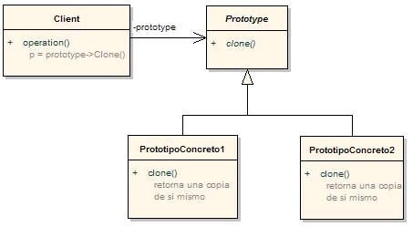

* **Prototype:** declara la interface del objeto que se clona. Suele ser una clase abstracta.
* **PrototypeConcreto:** las clases en este papel implementan una operación por medio de la clonación de sí mismo. 
* **Cliente:** crea nuevos objetos pidiendo al prototipo que se clone. 

Los objetos de Prototipo Concreto heredan de Prototype y de esta forma el patrón se asegura de que los objetos prototipo proporcionan un conjunto consistente de métodos para que los objetos clientes los utilicen.

Debemos Utilizar este patron cuando:

* Aplica en un escenario donde sea necesario la creación de objetos parametrizados como "recién salidos de fábrica" ya listos para utilizarse, con la gran ventaja de la mejora de la performance: clonar objetos es más rápido que crearlos y luego setear cada valor en particular.
* Este patrón debe ser utilizado cuando un sistema posea objetos con datos repetitivos, en cuanto a sus atributos: por ejemplo, si una biblioteca posee una gran cantidad de libros de una misma editorial, mismo idioma, etc. Hay que pensar en este patrón como si fuese un fábrica que tiene ciertas plantillas de ejemplos de sus prodcutos y, a partir de estos prototipos, puede crear una gran cantidad de productos con esas características.

## III.IV Abstract Factory
Por definicion se expresa como:

"Este patrón crea diferentes familias de objetos. Su objetivo principal es soportar múltiples estándares que vienen definidos por las diferentes jerarquías de herencia de objetos. Es similar al Factory Method, sólo que esta orientado a combinar productos."

Se expresa en diagrama UML:

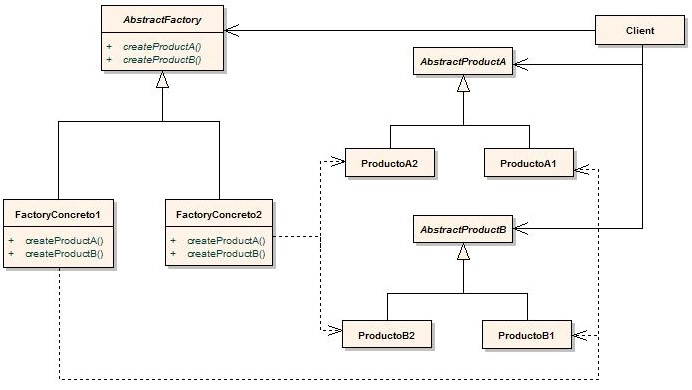

* **AbstractFactory:** declara una interfaz para la creación de objetos de productos abstractos.
* **ConcreteFactory:** implementa las operaciones para la creación de objetos de productos concretos.
* **AbstractProduct:** declara una interfaz para los objetos de un tipo de productos.
* **ConcreteProduct:** define un objeto de producto que la correspondiente factoría concreta se encargaría de crear, a la vez que implementa la interfaz de producto abstracto.
* **Client:** utiliza solamente las interfaces declaradas en la factoría y en los productos abstractos. 
Una única instancia de cada FactoryConcreto es creada en tiempo de ejecución. AbstractFactory delega la creación de productos a sus subclases FactoryConcreto.

Debemos usar este Patron cuando:

* Un sistema se debe configurar con una de entre varias familias de productos.
* Una familia de productos relacionados están hechos para utilizarse juntos.

## III.V Factory Method
Se define como:

*"el patrón de diseño Factory Method consiste en utilizar una clase constructora (al estilo del Abstract Factory) abstracta con unos cuantos métodos definidos y otro(s) abstracto(s): el dedicado a la construcción de objetos de un subtipo de un tipo determinado. Es una simplificación del Abstract Factory, en la que la clase abstracta tiene métodos concretos que usan algunos de los abstractos; según usemos una u otra hija de esta clase abstracta, tendremos uno u otro comportamiento."*

Se expresa como diagrama en UML:

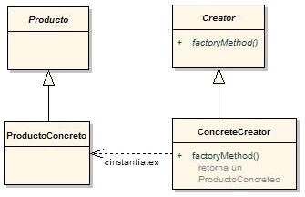

* **Creator:** declara el método de fabricación (creación), que devuelve un objeto de tipo Product. 
* **ConcretCreator:** redefine el método de fabricación para devolver un producto.
* **ProductoConcreto:** es el resultado final. El creador se apoya en sus subclases para definir el método de fabricación que devuelve el objeto apropiado.

Debemos usar este patron cuando:

* Una clase no puede anticipar el tipo de objeto que debe crear y quiere que sus subclases especifiquen dichos objetos.
* Hay clases que delegan responsabilidades en una o varias subclases. Una aplicación es grande y compleja y posee muchos patrones creacionales. 

## IV Patrones Estructurales

Los patrones estructurales se enfocan en como las clases y objetos se componen para formar estructuras mayores, los patrones estructurales describen como las estructuras compuestas por clases crecen para crear nuevas funcionalidades de manera de agregar a la estructura flexibilidad y que la misma pueda cambiar en tiempo de ejecución lo cual es imposible con una composición de clases estáticas a pesar que se nombrarán todos para que haya claridad, en este documento solo nos centraremos en los dos anteriormente mencionados

estos patrones estan conformados por:

* **Adapter**
* **Bridge**
* **Composite**
* **Decorator**
* **Facade**
* **Flyweight**
* **Proxy**

 ## IV.I Bridge
 Por definicion el patron define su funcionalidad como:
 
 "También conocido como Handle/Body, es una técnica usada en programación para desacoplar una abstracción de su implementación, de manera que ambas puedan ser modificadas independientemente sin necesidad de alterar por ello la otra. Esto es, se desacopla una abstracción de su implementación para que puedan variar independientemente."
 
Un ejemplo de como debe ser su funcionamiento en un diagrama UML es:

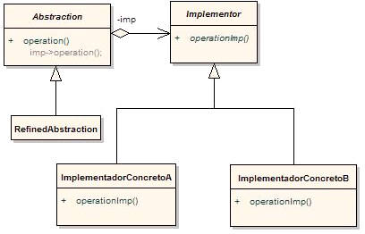

* **Abstraction:** define una interface abstracta. Mantiene una referencia a un objeto de tipo Implementor.
* **RefinedAbstraction:** extiende la interface definida por Abstraction.
* ***Implementor:** define la interface para la implementación de clases. Esta interface no se tiene que corresponder exactamente con la interface de Abstraction; de hecho, las dos interfaces pueden ser bastante diferentes entre sí. Típicamente la interface Implementor provee sólo operaciones primitivas, y Abstraction define operaciones de alto nivel basadas en estas primitivas.
* **ImplementadorConcreto:** implementa la interface de Implementor y define su implementación concreta.

* **¿Cuando se debe usar este patron?**
* Se desea evitar un enlace permanente entre la abstracción y su implementación. Esto puede ser debido a que la implementación debe ser seleccionada o cambiada en tiempo de ejecución.
* Tanto las abstracciones como sus implementaciones deben ser extensibles por medio de subclases. En este caso, el patrón Bridge permite combinar abstracciones e implementaciones diferentes y extenderlas independientemente.
* Cambios en la implementación de una abstracción no deben impactar en los clientes, es decir, su código no debe tener que ser recompilado.
* Se desea compartir una implementación entre múltiples y este hecho debe ser escondido a los clientes.
Permite simplificar jerarquías demasiado pobladas.

## Ejemplo

interface Implementador {

    public abstract void operacion();
    
}
 
/** primera implementacion de Implementador **/

class ImplementacionA implements Implementador{

    public void operacion() {
    
        System.out.println("Esta es la implementacion A");
        
    }
    
}

/** segunda implementacion de Implementador **/

class ImplementacionB implements Implementador{

    public void operacion() {
    
        System.out.println("Esta es una implementacion de B");
        
    }
    
}

/** interfaz de abstracción **/

interface Abstraccion {

    public void operacion();
    
}

/** clase refinada que implementa la abstraccion **/

class AbstraccionRefinada implements Abstraccion{

    private Implementador implementador;
    
    public AbstraccionRefinada(Implementador implementador){
    
        this.implementador = implementador;
        
    }
    
    public void operacion(){
    
        implementador.operacion();
        
    }
    
}

/** aplicacion que usa el patrón Bridge **/

public class EjemploBridge {

    public static void main(String[] args) {
    
        Abstraccion[] abstracciones = new Abstraccion[2];
        
        abstracciones[0] = new AbstraccionRefinada(new ImplementacionA());
        
        abstracciones[1] = new AbstraccionRefinada(new ImplementacionB());
        
        for(Abstraccion abstraccion:abstracciones)
        
            abstraccion.operacion();
            
    }
    
}

 ## IV.II Decorator
 
 Por definición la funcionalidad de este patrón se expresa como:
 
“responde a la necesidad de añadir dinámicamente funcionalidad a un Objeto. Esto nos permite no tener que crear sucesivas clases que hereden de la primera incorporando la nueva funcionalidad, sino otras que la implementan y se asocian a la primera.”

Un ejemplo de cómo debería expresarse la funcionalidad de este patrón mediante un diagrama en UML es: 

 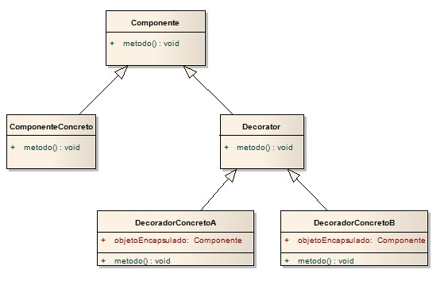
 
 *Fig 3. Design Patterns: Elements of Reusable Object-Oriented Software*

* **Componente**: Se quiere agregar o quitar dinámicamente la funcionalidad de un objeto.
* **ComponenteConcreto:** Se quiere agregar o quitar dinámicamente la funcionalidad de un objeto.
* **Decorator:** Se quiere agregar o quitar dinámicamente la funcionalidad de un objeto.
* **DecoradorConcreto:** Se quiere agregar o quitar dinámicamente la funcionalidad de un objeto.

### ¿cuándo se debe usar este patrón?

•	necesitamos añadir funcionalidades a una clase de forma dinámica, evitando las jerarquías de clases que se tienen construir en tiempo de compilación.
•	Hay una necesidad de extender la funcionalidad de una clase, pero no hay razones para extenderlo a través de la herencia.
•	Se quiere agregar o quitar dinámicamente la funcionalidad de un objeto.

Ejemplo práctico:

Imaginemos que vendemos automóviles y el cliente puede opcionalmente adicionar ciertos componentes (aire acondicionado, mp3 player, etc). Por cada componente que se adiciona, el precio varía.
 
 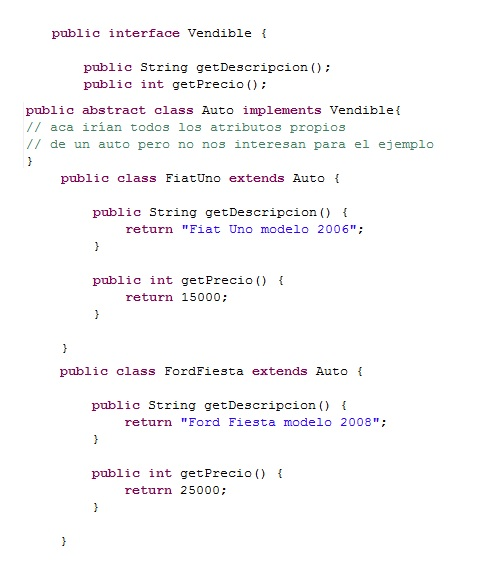
 
 *Fig 3. Diagrama UML Decorator*
 
Bien, hasta aquí clases comunes de negocio: una interface que implementa la clase Auto y dos tipos de Auto (Ford y Fiat). Ahora veremos en que consiste el Decorator y los decoradores:
 
 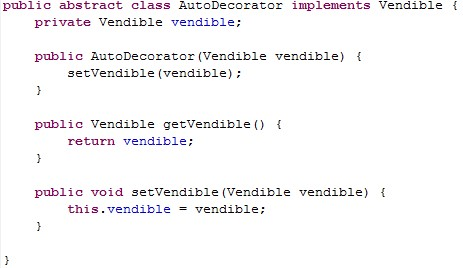

 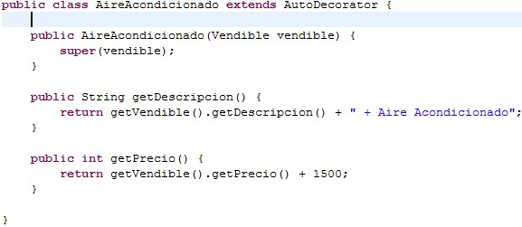

 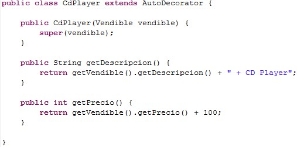

 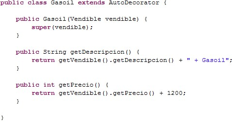

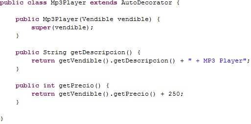

Veremos cómo funciona desde el punto de vista del cliente:
 
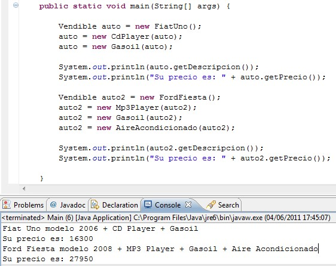

## IV.III Composite
Segun la definicion, se explica como:

"Composite sirve para construir objetos complejos a partir de otros más simples y similares entre sí, gracias a la composición recursiva y a una estructura en forma de árbol."

Expresado en diagramna tipo UML:

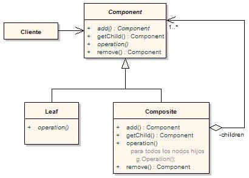

* **Component:** implementa un comportamiento común entre las clases y declara una interface de manipulación a los padres en la estructura recursiva.
* **Leaf:** representa los objetos “hoja” (no poseen hijos). Define comportamientos para objetos primitivos.
* **Composite:** define un comportamiento para objetos con hijos. Almacena componentes hijos. implementa operaciones de relación con los hijos.
* **Cliente:** manipula objetos de la composición a través de Component.

Los clientes usan la interfaz de Component para interactuar con objetos en la estructura Composite. Si el receptor es una hoja, la interacción es directa. Si es un Composite, se debe llegar a los objetos “hijos”, y puede llevar a utilizar operaciones adicionales.

**Debemos usar este patron cuando:**
* Se busca representar una jerarquía de objetos como “parte-todo”.
* Se busca que el cliente puede ignorar la diferencia entre objetos primitivos y compuestos (para que pueda tratarlos de la misma manera).

## Ejemplo

import java.util.*;

public abstract class Componente

{

	protected String nombre;
 
	public Componente (String nombre)
 
	{
 
		this.nombre = nombre;
  
	}
 
	abstract public void agregar(Componente c);
 
	abstract public void eliminar(Componente c);
 
	abstract public void mostrar(int profundidad);
 
}

class Compuesto extends Componente

{

	private ArrayList<Componente> hijo = new ArrayList<Componente>();
 
	public Compuesto (String name)
 
	{
 
		super(name);
  
	}

 @Override
 
	public void agregar(Componente componente)
 
	{
 
		hijo.add(componente);
  
	}
 
	@Override
 
	public void eliminar(Componente componente)
 
	{
 
		hijo.remove(componente);
  
	}
 
	@Override
 
	public void mostrar(int profundidad)
 
	{
 
		System.out.println(nombre + " nivel: " + profundidad);
  
		for (int i = 0; i < hijo.size(); i++)
  
			hijo.get(i).mostrar(profundidad + 1);
   
	}
 
}

class Hoja extends Componente

{

	public Hoja (String nombre)
 
	{
 
		super(nombre);
  
	}
 
	public void agregar(Componente c)
 
	{
 
		System.out.println("no se puede agregar la hoja");
  
	}
 
	public void eliminar(Componente c)
 
	{
 
		System.out.println("no se puede quitar la hoja");
  
	}
 
	public void mostrar(int depth)
 
	{
 
		System.out.println('-' + "" + nombre);
  
	}
 
}

public class Client

{

	public static void main(String[] args)
 
	{
 
		Compuesto raiz = new Compuesto("root");
  
		raiz.agregar(new Hoja("hoja A"));
  
		raiz.agregar(new Hoja("hoja B"));
  
		Compuesto comp = new Compuesto("compuesto X");
  
		comp.agregar(new Hoja("hoja XA"));
  
		comp.agregar(new Hoja("hoja XB"));
  
		raiz.agregar(comp);
  
		raiz.agregar(new Hoja("hoja C"));
  
		Hoja l = new Hoja("hoja D");
  
		raiz.agregar(l);
  
		raiz.eliminar(l);
  
		raiz.mostrar(1);
  
	}
 
}

## IV.IV Facade

La definicion del patron se expresa:

"es un tipo de patrón de diseño estructural. Viene motivado por la necesidad de estructurar un entorno de programación y reducir su complejidad con la división en subsistemas, minimizando las comunicaciones y dependencias entre estos."

Su funcionalidad segun su diagrama en UML es:
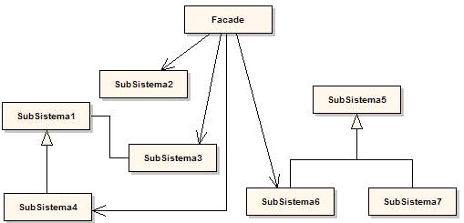

* **Facade:**  conoce cuales clases del subsistema son responsables de una petición. 
Delega las peticiones de los clientes en los objetos del subsistema.
* **Subsistema:** manejar el trabajo asignado por el objeto Facade. No tienen ningún conocimiento del Facade (no guardan referencia de éste).

Los clientes se comunican con el subsistema a través de la facade, que reenvía las peticiones a los objetos del subsistema apropiados y puede realizar también algún trabajo de traducción. Los clientes que usan la facade no necesitan acceder directamente a los objetos del sistema.
Debemos utilizar este patron cuando:

* Se quiera proporcionar una interfaz sencilla para un subsistema complejo.
* Se quiera desacoplar un subsistema de sus clientes y de otros subsistemas, haciéndolo más independiente y portable.
* Se quiera dividir los sistemas en niveles: las fachadas serían el punto de entrada a cada nivel. Facade puede ser utilizado a nivel aplicación.

## Ejemplo

package com.genbetadev;

 public class FachadaImpresoraNormal {

 		Impresora impresora;

 		public FachadaImpresoraNormal(String texto) {

 		 		super();

 		 		impresora= new Impresora();

 		 		impresora.setColor(true);

 		 		impresora.setHoja("A4");

 		 		impresora.setTipoDocumento("PDF");

 		 		impresora.setTexto(texto);

 		 }

 		public void imprimir() {

 		 		impresora.imprimirDocumento();

 		 }

 }

## IV.V Adapter

Según la definición es patrón adapter se define como:

“Se utiliza para transformar una interfaz en otra, de tal modo que una clase que no pueda utilizar la primera haga uso de ella a través de la segunda.”

Es conocido como Wrapper (al patrón Decorator también se lo llama Wrapper, con lo cual es nombre Wrapper muchas veces se presta a confusión).

Una clase Adapter implementa un interfaz que conoce a sus clientes y proporciona acceso a una instancia de una clase que no conoce a sus clientes, es decir convierte la interfaz de una clase en una interfaz que el cliente espera. Un objeto Adapter proporciona la funcionalidad prometida por un interfaz sin tener que conocer que clase es utilizada para implementar ese interfaz. Permite trabajar juntas a dos clases con interfaces incompatibles.

Un ejemplo de como debe ir representado el patrón Adapter mediante un diagrama UML es:

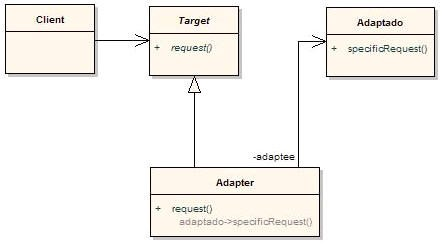
 
*Fig 4. Diagrama UML Adapter*

* **Target:** Define la interfaz específica del dominio que Cliente usa.
* **Cliente:** Colabora con la conformación de objetos para la interfaz Target.
* **Adaptado:** Define una interfaz existente que necesita adaptarse.
* **Adapter:** adapta la interfaz de Adapte a la interfaz Target.
•	El Cliente llama a las operaciones sobre una instancia Adapter. De hecho, el adaptador llama a las operaciones de Adapte que llevan a cabo el pedido.

### ¿Cuándo se debe usar este patrón?

•	Se quiere utilizar una clase que llame a un método a través de una interface, pero se busca utilizarlo con una clase que no implementa esa interface.
•	Se busca determinar dinámicamente que métodos de otros objetos llama un objeto.
•	No se quiere que el objeto llamado tenga conocimientos de la otra clase de objetos.

Ejemplo práctico:

Vamos a plantear el siguiente escenario: nuestro código tiene una clase Persona (la llamamos PersonaVieja) que se utiliza a lo largo de todo el código y hemos importado un API que también necesita trabajar con una clase Persona (la llamamos PersonaNueva), que si bien son bastante similares tienen ciertas diferencias:

Nosotros trabajamos con los atributos nombre, apellido y fecha de nacimiento.

Sin embargo, la PersonaNueva tiene un solo atributo nombre (que es el nombre y apellido de la persona en cuestión) y la edad actual, en vez de la fecha de nacimiento.

Para esta situación lo ideal es utilizar el Adapter. Para ello primero crearemos las 2 clases de Persona y sus correspondientes interfaces.
 
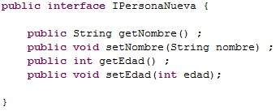

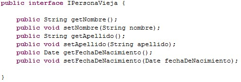

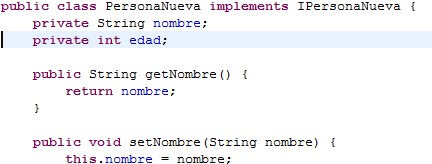

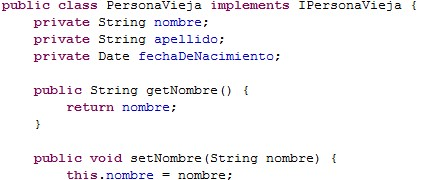 
 
Ahora crearemos al Adapter.

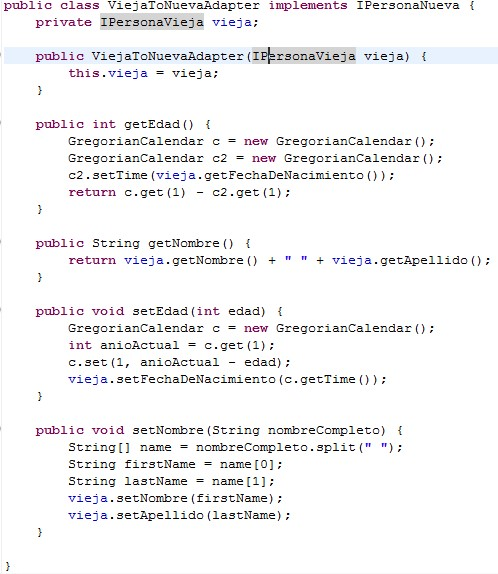
 
Y se utiliza de esta manera:

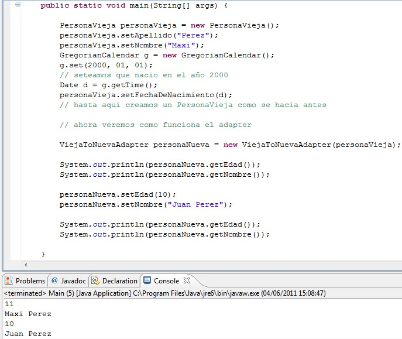

## IV.VI Flyweight

Busca eliminar o reducir la redundancia cuando tenemos gran cantidad de objetos que contienen información idéntica, además de lograr un equilibrio entre flexibilidad y rendimiento.
Este patrón quiere evitar el hecho de crear un gran número estados de objeto para representar a un sistema. Permite compartir estados para soportar un gran número de objetos pequeños aumentando la eficiencia en espacio.

### ¿cuándo se debe usar este patrón?

•	Para eliminar o reducir la redundancia cuando se tiene gran cantidad de objetos que contienen la misma información.

•	Cuando la memoria es crítica para el rendimiento de la aplicación.

•	La aplicación no depende de la identidad de los objetos.

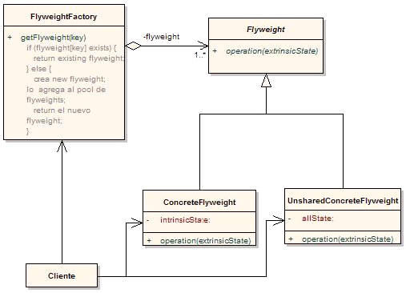

* **Flyweight:** declara una interfaz a través de la cual los flyweights pueden recibir y actuar sobre los estados no compartidos.
* **ConcreteFlyweight:** implementa la interfaz Flyweight y almacena los estados compartidos, si los hay. Un objeto ConcreteFlyweight debe ser compartible. Cualquier estado que almacene debe ser intrínseco; es decir, debe ser independiente de su contexto.
* **UnsharedConcreteFlyweight:** no todas las subclases de Flyweight tienen por qué ser compartidas. La interfaz Flyweight permite que se comparta; no lo fuerza. Es común que los objetos de esta clase tengan hijos de la clase ConcreteFlyweight en algún nivel de su estructura.
* **FlyweightFactory:** crea y gestiona los objetos flyweight. Garantiza que los objetos flyweight se comparten de forma apropiada. Cuando un cliente solicita un flyweight, el objeto de la clase FlyweightFactory proporciona una instancia existente, o crea una.
* **Client:** contiene referencias a los flyweights. Calcula o almacena los estados no compartidos de los flyweights.

## IV.VII Proxy

Se utiliza como intermediario para acceder a un objeto, permitiendo controlar el acceso a él. Para ello obliga que las llamadas a un objeto ocurran indirectamente a través de un objeto proxy, que actúa como un sustituto del objeto original, delegando luego las llamadas a los métodos de los objetos respectivos.

Existen diferentes tipos de proxy:

* **Proxy remoto:** proporciona un representante local de un objeto situado en otro espacios de direcciones (en otro dispositivo conectado en red).
* **Proxy virtual:** usados para crear objetos costosos sólo cuando se soliciten.
* **Proxy de protección:** permiten controlar el acceso a un objeto cuando es accesible o no, dependiendo de determinados permisos.
* **Referencia inteligente:** un sustito de un puntero, que realiza operaciones adicionales en el momento de accederse al objeto.

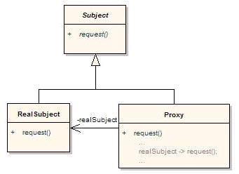

* **Subject:** interfaz o clase abstracta que proporciona un acceso común al objeto real y su representante (proxy).
* **Proxy:** mantiene una referencia al objeto real. Controla la creación y acceso a las operaciones del objeto real.
* **RealSubject:** define el objeto real representado por el Proxy.
* **Cliente:** solicita el servicio a través del Proxy y es éste quién se comunica con el RealSubject.

## Ejemplo

/**

 * Éste es el objeto Proxy. Este proxy es simultáneamente un 
 
 *
 
 * (a) proxy virtual que retrasa la creación del objeto real hasta que
 
 *     se invoca alguno de sus métodos.
 
 * (b) referencia inteligente, realizando labores de contabilización
 
 *     del número de veces que se invoca un método.
 
 */
 

public class Proxy extends Sujeto {

   /**
   
    * el constructor de la clase, además de inicializar a la parte
    
    * correspondiente a la superclase, establece a null la referencia
    
    * al sujeto real e inicializa la contabilización.
    
    */
    

  public Proxy (String nombre) {
  
     super(nombre);
     
    _sujetoReal = null;
    
   _accesosMetodo1 = 0;
   
   _accesosMetodo2 = 0;
   
  }
  

  /**
  
   * En lugar de realizar de cada vez una comprobación de si el
   
   * sujeto real esta creado y en caso contrario crearlo, se define
   
   * este método privado.
   
   */
   

  private SujetoReal obtenerSujetoReal() {
  
  
  if (_sujetoReal == null)
  
  
  _sujetoReal = new SujetoReal(this + " (Real)");
  

return _sujetoReal;

  }
  
 /**
 
   * Los métodos delegan en el sujeto real.
   
   */
   

  public void metodo1() { 
  
    _accesosMetodo1++; 
    
    obtenerSujetoReal().metodo1(); 
    
  }
  

  public void metodo2() { 
  
    _accesosMetodo2++;
    
    obtenerSujetoReal().metodo2(); 
    
  }
  

  /**
  
    * Este método permite presentar información de contabilización
    
    * de uso del objeto.
    
    */
    

  public String toString() {
  
    if (_sujetoReal != null)
    
      System.out.println("Accesos a " + _sujetoReal + 
      
                         ": metodo1=" + _accesosMetodo1 + 
			 
                         ", metodo2=" + _accesosMetodo2);
			 
    else 
    
      System.out.println("Sujeto Real (" + this + ") no creado.");
      

    return "";
    
  }
  

  /**
  
   * Atributos privados: _sujetoReal que le permite a la clase Proxy tener una referencia al sujeto real y los contabilizadores de los accesos a
   
  * los métodos 1 y 2.
  
   */
   

  private SujetoReal _sujetoReal; 
  
  private int  _accesosMetodo1, _accesosMetodo2;
  
}

## Referencias

* https://migranitodejava.blogspot.com.co/
* http://blog.koalite.com/2016/12/los-patrones-de-diseno-hoy-patrones-estructurales/
* https://highscalability.wordpress.com/2010/04/12/patrones%C2%A0estructurales/
* Aplicacion Mobil de GoF
* http://www.cristalab.com/tutoriales/patrones-de-diseno
* http://lineadecodigo.com/patrones/patrones-creacionales/
